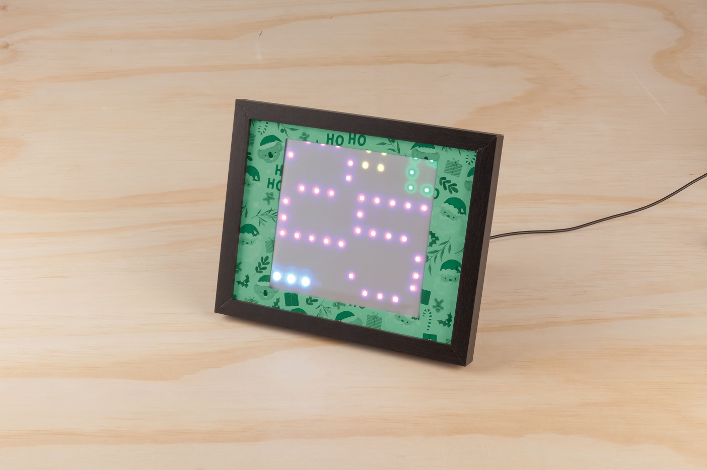

# Game Of Life

Looking for a new conversation starter in your home? Build our Game of Life wall thermostat using new [XC4390](https://jaycar.com.au/p/XC4390) addressable RGB light strip. The display uses the nice bright colors from the strip to show off the temperature and the interesting patterns of conway's game of life.

## Bill of Materials

In addition to all this below, we have also got a small photo frame from our local officeworks. The lighting strip will give us atleast 100 LEDs, which is 10x10, spaced at around 17mm away from each other, meaning you'll need about a 170x170 mm hole to mount into.

| Qty | Code                                     | Description                     |
| --- | ---------------------------------------- | ------------------------------- |
| 1   | [XC4390](https://jaycar.com.au/p/XC4390) | Strip lighting  ( 120 LEDs )    |
| 1   | [XC4520](https://jaycar.com.au/p/XC4520) | temperature and humidity sensor |
| 1   | [XC4431](https://jaycar.com.au/p/XC4431) | leonardo tiny 32u4              |
| 1   | [WH3032](https://jaycar.com.au/p/WH3032) | Solid core wire                 |

### You might also want
 - USB power cable and wall adaptor such as ([WC7724](https://jaycar.com.au/p/WC7724)) and ([MP3455](https://jaycar.com.au/p/MP3455))
 - RTC Module ([XC4450](https://jaycar.com.au/p/XC4450)) to show the time
 - [XC4444](https://jaycar.com.au/p/XC4444) Motion detection module to come to life when someone walks past
 - [XC3742](https://jaycar.com.au/p/XC3742) Gesture sensor to set up games and interactivity

## Patterns enabled:

- Temperature setting, with colour gradient based on temperature.
- Rainbow game of life

## Source code

| Library            | Author           | Version |
| ------------------ | ---------------- | ------- |
| Adafruit NeoPixel  | Adafruit         | 1.6.0   |
| Adafruit NeoMatrix | Adafruit         | 1.1.5   |
| SDHT               | Helder Rodrigues | 2.0.0   |

This repository contains the code for the 32u4 mini. It uses both the `Adafruit NeoPixel`  and `NeoMatrix` libraries, ironically enough using the matrix to display the temperature and the neopixel strip to manage the game of life; It also then uses a small timer check in the main loop to switch between displaying the game and displaying the temperature.

Game of life is just implemented with a `100` element 8bit array that is bitshifted between each state. A neat idea could be to use some of the bits to

## How to build

 For how to build instructions, check out https://jaycar.com.au/

## How to improve

There's a few changes that could be done to this project. One we were thinking of was doing 3 seperate game of life's, for the Red, Green and Blue. This could produce some trippy effects and would invole minimal changes to the `gameoflife.h` file.

To make improvements:

1. Star this respository at the top of the github repository page.
2. 'Fork' this repository into your own account.
3. Make changes to your local github copy by *Cloning* your version, *commit*-ing changes, and *pushing* to your github account
4. open a pull request to merge your changed version of the project with our master version

We'll review the changes and merge them in if they help make the project great! plus your name will be included into a contributors list.